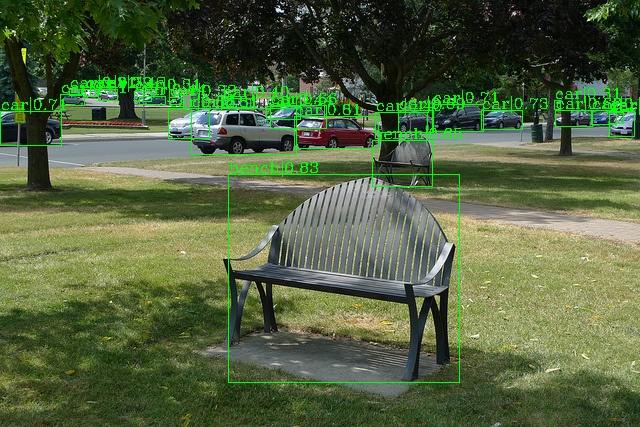

# SpineNet
* Reference : [SpineNet: Learning Scale-Permuted Backbone for Recognition and Localization](https://arxiv.org/abs/1912.05027), 2020
* 기존의 CNN 구조를 활용한 객체 탐지는 이미지의 특성(feature)을 추출하는 과정을 거치게 되어, 하위 레이어들은 낮은 공간적 차원을 가지게 되므로, 탐지에 중요한 영향을 미치는 특징점이 누락되는 문제가 발생할 수 있음.
* SpineNet은 스케일 순열(Scale Permutations)과 Cross-scale Connection을 학습하여, 모델의 레이어가 깊어져도 중간과정의 Feature Map의 해상도는 가변적이며, 서로 다른 사이즈의 Feature map이 연결될 수 있게 하였음.

* 2 Stage 기반(Mask R-CNN)으로 COCO 데이터셋으로 학습 및 평가한 결과, 기존 인공지능 모델 대비 유의미한 높은 AP를 기록하였으며, 현재 Paperswithcode의 Instance Segmentation 부문16위에 위치하고 있음.(2022. 05월 기준)


## 학습 데이터 셋
* Training : 180,800장(80%)
* Validation : 22,600장(10%)
* Test : 22,600장(10%)

## 데이터셋 설정
* [class_spinenet_final_cycle.py](https://github.com/contilabcau/spinenet1/blob/main/configs/spinenet/class_spinenet_final_cycle.py)

## 모델 설정 (하이퍼파라메터 등)
* [spinenet_final_cycle.py ](https://github.com/contilabcau/spinenet1/blob/main/configs/spinenet/spinenet_final_cycle.py)

## 모델 LICENSE 정보
* [LICENSE](https://github.com/contilabcau/spinenet1/blob/main/LICENSE)


# SpineNet-Pytorch 상세 정보 (참조 : [yan-roo/SpineNet-Pytorch](https://github.com/yan-roo/SpineNet-Pytorch))
[](https://paperswithcode.com/sota/object-detection-on-coco?p=spinenet-learning-scale-permuted-backbone-for)<br>
[](https://paperswithcode.com/sota/instance-segmentation-on-coco?p=spinenet-learning-scale-permuted-backbone-for)<br>



[SpineNet](https://arxiv.org/abs/1912.05027) is a scale-permuted backbone for object detection, proposed by Google Brain in CVPR 2020. This project is a kind of implementation of SpineNet using mmdetection.

It is highly based on the
* [lucifer443/SpineNet-Pytorch](https://github.com/lucifer443/SpineNet-Pytorch)
* The paper [SpineNet: Learning Scale-Permuted Backbone for Recognition and Localization](https://arxiv.org/abs/1912.05027)
* [Official TensorFlow Implementation](https://github.com/tensorflow/tpu/tree/master/models/official/detection)

## Models
### Instance Segmentation Baselines
#### Mask R-CNN (Trained from scratch)
| Backbone     | Resolution  |box AP|mask AP| Params | FLOPs   |box mAP <br> (paper)|mask mAP <br> (paper)| Params <br> (paper) | FLOPs <br> (paper) | Download |
| ------------ | ----------  | ---- | ----- | ------ | ------- | ------------------ | ------------------- | ------------------- | ------------------ | -------- |
| [SpineNet-49S](configs/spinenet/mask_rcnn_spinenet_49S_B_8gpu_640.py)|   640x640   | 39.7 | 34.9 | 13.92M | 63.77B   | 39.3 | 34.8 | 13.9M | 60.2B  | [model](https://drive.google.com/file/d/1WEa7y8kFXPoCtDEeNpTzJrKpVlMbjiGG/view?usp=sharing) |

## Installation

### 1. Install mmdetection

   This implementation is based on [mmdetection](https://github.com/open-mmlab/mmdetection)(v1.1.0+8732ed9).
   
   Please refer to [INSTALL.md](docs/INSTALL.md) for more information.

   a. Create a conda virtual environment and activate it.
   ```shell
   conda create -n mmlab python=3.7 -y
   conda activate mmlab
   ```

   b. Install PyTorch and torchvision following the [official instructions](https://pytorch.org/), e.g.,

   ```shell
   conda install pytorch==1.4.0 torchvision==0.5.0 cudatoolkit=10.1 -c pytorch
   ```
   c. Install mmcv
   
   ```shell
   pip install mmcv==0.4.3
   ```  
   
   d. Clone the mmdetection repository.

   ```shell
   git clone https://github.com/open-mmlab/mmdetection.git
   cd mmdetection
   git checkout 8732ed9
   ```

   e. Install build requirements and then install mmdetection.
   (We install pycocotools via the github repo instead of pypi because the pypi version is old and not compatible with the latest numpy.)

   ```shell
   pip install -r requirements/build.txt
   pip install "git+https://github.com/cocodataset/cocoapi.git#subdirectory=PythonAPI"
   pip install -v -e .  # or "python setup.py develop"
   ```

## Getting started
### 1. Copy the codes to mmdetection directory

```shell
git clone https://github.com/yan-roo/SpineNet-Pytorch.git
cp -r mmdet/ mmdetection/
cp -r configs/ mmdetection/
```

### 2. Prepare dataset (COCO)

```shell
wget http://images.cocodataset.org/zips/train2017.zip
wget http://images.cocodataset.org/zips/val2017.zip
wget http://images.cocodataset.org/zips/test2017.zip
wget http://images.cocodataset.org/annotations/annotations_trainval2017.zip
unzip ${train/val/test}2017.zip
mv ${train/val/test}2017  ${mmdetection/data/coco/}
```

  The directories should be arranged like this:

     >   mmdetection
     >     ├── mmdet
     >     ├── tools
     >     ├── configs
     >     ├── data
     >     │   ├── coco
     >     │   │   ├── annotations
     >     │   │   ├── train2017
     >     │   │   ├── val2017
     >     │   │   ├── test2017


### 3. Train a model

**\*Important\***: The default learning rate in SpineNet-49S config files is for 8 GPUs and [32 img/gpu](https://github.com/yan-roo/SpineNet-Pytorch/blob/master/configs/spinenet/spinenet_49S_B_8gpu.py#L87) (batch size = 8*32 = 256).

According to the [Linear Scaling Rule](https://arxiv.org/abs/1706.02677), you need to set the learning rate proportional to the batch size if you use different GPUs or images per GPU.

e.g., lr=0.28 for 8 GPUs * 32 img/gpu and lr=0.07 for 8 GPUs * 8 img/gpu.

You also can set the [warm-up iterations](https://github.com/yan-roo/SpineNet-Pytorch/blob/master/configs/spinenet/spinenet_49S_B_8gpu.py#L117).

e.g., warmup_iters=2000 for batch size 256 and warmup_iters=8000 for batch size 64

#### Train with a single GPU
Modify [config/spinenet/model.py Line5](https://github.com/yan-roo/SpineNet-Pytorch/blob/master/configs/spinenet/spinenet_49S_B_8gpu.py#L5)
type='SyncBN' -> type='BN'

```shell
CONFIG_FILE=configs/spinenet/spinenet_49S_B_8gpu.py
python tools/train.py ${CONFIG_FILE} [optional arguments]
```

_[optional arguments]:_ --resume_from ${epoch_.pth} / --validate

#### Train with multiple GPUs

```shell
CONFIG_FILE=configs/spinenet/spinenet_49S_B_8gpu.py
bash tools/dist_train.sh ${CONFIG_FILE} ${GPU_NUM} [optional arguments]
```
### 4. Calculate parameters and FLOPs

```shell
python tools/get_flops.py ${CONFIG_FILE} --shape $SIZE $SIZE
```

### 5. Evaluation

   ```shell
   python tools/test.py ${CONFIG_FILE} ${CHECKPOINT_FILE} --out  ${OUTPUT_FILE} --eval bbox
   python tools/test.py ${CONFIG_FILE} ${CHECKPOINT_FILE} --out  ${OUTPUT_FILE} --eval bbox segm
   ```

More usages can reference [GETTING_STARTED.md](docs/GETTING_STARTED.md) or [MMDetection documentation](https://mmdetection.readthedocs.io/).

## Issues & FAQ

   1. ModuleNotFoundError: No module named 'mmcv.cnn.weight_init'

      ```
      pip install mmcv==0.4.3	
      ```

   2. [ImportError: libtorch_cpu.so: cannot open shared object file: No such file or directory](https://github.com/open-mmlab/mmdetection/issues/2627)

      ```
      rm -r build
      python setup.py develop
      ```
   3. AssertionError: Default process group is not initialized
   
      Modify [config/spinenet/model.py Line5](https://github.com/yan-roo/SpineNet-Pytorch/blob/master/configs/spinenet/spinenet_49S_B_8gpu.py#L5) type='SyncBN' -> type='BN'
